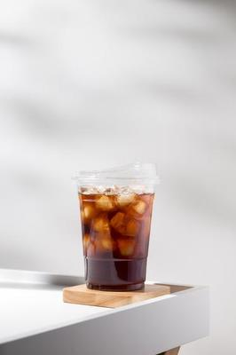

<!DOCTYPE html>
<html lang="en">
<head>
    <meta charset="UTF-8">
    <meta name="viewport" content="width=device-width, initial-scale=1.0">
    <title>Teraz menu</title>
    
    
</head>
<body class="min-h-screen pb-20">
    

        <!-- Header -->
        

            <h1 class="text-4xl md:text-5xl font-bold text-[#6F4E37] mb-4">Teraz Menu</h1>
            
Handcrafted beverages and freshly prepared food made with premium ingredients

        

        
        <!-- Category Tabs -->
        

            

                <button onclick="filterMenu('all')" class="text-sm font-medium px-6 py-3 tab-active whitespace-nowrap">All Menu</button>
                <button onclick="filterMenu('coffee')" class="text-sm font-medium px-6 py-3 whitespace-nowrap">Coffee & Tea</button>
                <button onclick="filterMenu('food')" class="text-sm font-medium px-6 py-3 whitespace-nowrap">Food</button>
                <button onclick="filterMenu('dessert')" class="text-sm font-medium px-6 py-3 whitespace-nowrap">Desserts</button>
            

        

        
        <!-- Search -->
        

            

                <input type="text" id="search-input" placeholder="Search menu items..." class="w-full px-4 py-3 rounded-full border border-gray-300 focus:outline-none focus:ring-2 focus:ring-amber-700">
                <button class="absolute right-3 top-3 text-gray-400">
                    <svg xmlns="http://www.w3.org/2000/svg" class="h-6 w-6" fill="none" viewBox="0 0 24 24" stroke="currentColor">
                        <path stroke-linecap="round" stroke-linejoin="round" stroke-width="2" d="M21 21l-6-6m2-5a7 7 0 11-14 0 7 7 0 0114 0z" />
                    </svg>
                </button>
            

        

        
        <!-- Menu Items Grid -->
        

            <!-- Coffee Items -->
            

                

                    
                

                

                    <h3 class="text-xl font-semibold mb-2">Kopi jadul</h3>
                    
Rich, bold flavor with caramel notes and a silky crema

                

            

            
            

                

                    
                

                

                    <h3 class="text-xl font-semibold mb-2">Creamy Latte</h3>
                    
Smooth espresso with steamed milk and delicate foam art

                

            

            
            

                

                    
                

                

                    <h3 class="text-xl font-semibold mb-2">Iced Matcha Latte</h3>
                    
Premium ceremonial matcha whisked with oat milk over ice

                

            

            
            <!-- Food Items -->
            

                

                    
                

                

                    <h3 class="text-xl font-semibold mb-2">Avocado Toast</h3>
                    
Sourdough bread with smashed avocado, cherry tomatoes, and sea salt

                

            

            
            

                

                    
                

                

                    <h3 class="text-xl font-semibold mb-2">Morning Sandwich</h3>
                    
English muffin with egg, bacon, cheddar, and garlic aioli

                

            

            
            <!-- Dessert Items -->
            

                

                    
                

                

                    <h3 class="text-xl font-semibold mb-2">Chocolate Croissant</h3>
                    
Buttery, flaky pastry with rich dark chocolate filling

                

            

            
            

                

                    
                

                

                    <h3 class="text-xl font-semibold mb-2">Banana Walnut Bread</h3>
                    
Homemade bread with ripe bananas, walnuts, and cinnamon

                

            

        

    

    
</body>
</html>
